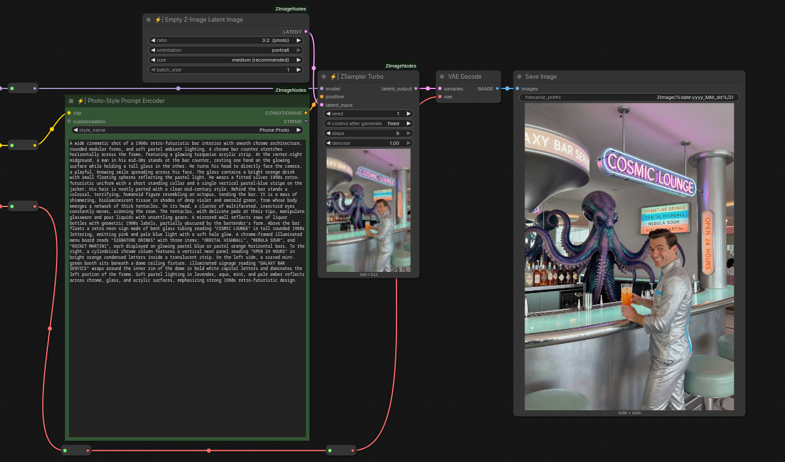

<div align="center">

# Z-Image Power Nodes <br><sub><sup><i>Pushing the best image generation model to its limits!</i></sup></sub>
[](#)
[](#)
[](#)
[](#)

</img>

</div>

**ComfyUI-ZImagePowerNodes** is a collection of custom nodes designed and refined specifically for the [Z-Image model](https://github.com/Tongyi-MAI/Z-Image). They are based on some ideas and discoveries I made while developing the [Amazing Z-Image Workflow](https://github.com/martin-rizzo/AmazingZImageWorkflow).


## Table of Contents
1. [Nodes](#nodes)
2. [Examples](#examples)
3. [Installation](#installation)
4. [Recommended Checkpoints](#recommended-checkpoints)
5. [License](#license)

## Nodes

### ⚡ ZSampler Turbo

 * A specialized sampler designed to divide the denoising process into three stages: composition, details, and refinement. It maintains image stability between 4 and 9 steps and achieves sufficient quality and detail starting from step 7, eliminating the need for further refining or post-processing. \
   **["ZSampler Turbo" node documentation](docs/zsampler_turbo.md)**.

### ⚡ Style & Prompt Encoder
 * Applies a selected visual styles to the prompt and encodes them using a text-encoder model (clip). Enables generating images that follow the desired aesthetic while guiding the diffusion process. \
   **["Style Prompt Encoder" node documentation](docs/style_prompt_encoder.md)**

### ⚡ Style String Injector
 * Applies ...

### ⚡ Save Image
 * This node saves generated images with an option to include CivitAI-compatible metadata. \
   **["Save Image" node documentation](docs/save_image.md)**.

### ⚡ Empty Z-Image Latent Image
 * Applies ...

### 💀 Photo-Style Prompt Encoder
 * Deprecated, use "Style & Prompt Encoder" node.

### 💀 Illustration-Style Prompt Encoder
 * Deprecated, use "Style & Prompt Encoder" node.


## Examples

A few example workflows demonstrating basic usage of these nodes can be found in the **[/workflows](/workflows)** directory.


## Installation
_Ensure you have the latest version of [ComfyUi](https://github.com/comfyanonymous/ComfyUI)._

### Installation via ComfyUI Manager (Recommended)

The easiest way to install the nodes is through [ComfyUI-Manager](https://github.com/Comfy-Org/ComfyUI-Manager):

  1. Open ComfyUI and click on the "Manager" button to launch the "ComfyUI Manager Menu".
  2. Within the ComfyUI Manager, locate and click on the "Custom Nodes Manager" button.
  3. In the search bar, type "Z-Image Power Nodes".
  4. Select the option from the search results and click the "Install" button.
  5. Restart ComfyUI to ensure the changes take effect.

### Manual Installation

<details>
<summary>🛠️ Manual installation instructions. (expand for details)</summary>
.

1. Open your preferred terminal application.
2. Navigate to your ComfyUI directory:
   ```bash
   cd <your_comfyui_directory>
   ```
3. Move into the **custom_nodes** folder and clone the repository:
   ```bash
   cd custom_nodes
   git clone https://github.com/martin-rizzo/ComfyUI-ZImagePowerNodes.git
   ```
</details>

### Windows Portable Installation

<details>
<summary>🛠️ Windows portable installation instructions. (expand for details)</summary>
.

1. Go to where you unpacked **ComfyUI_windows_portable**,  
   you'll find your `run_nvidia_gpu.bat` file here, confirming the correct location.
3. Press **CTRL + SHIFT + RightClick** in an empty space and select "Open PowerShell window here".
4. Clone the repository into your custom nodes folder using:
   ```
   git clone https://github.com/martin-rizzo/ComfyUI-ZImagePowerNodes .\ComfyUI\custom_nodes\ComfyUI-ZImagePowerNodes
   ```
</details>


## Recommended Checkpoints

### GGUF Format

<sub>GGUF checkpoints tend to run slightly slower in ComfyUI. However, if you are building a complex workflow that involves other models or using heavy LLMs with ollama, GGUF files can help prevent system freezes and OOM errors during generation, especially when VRAM is limited. For simple image generation workflows, a safetensors file (though heavier) might be preferable. When working with GGUF in Z-Image, from my experience, using the Q5_K_S quantization typically offers the best balance between file size and prompt response. </sub>

Note: ComfyUI does not natively support GGUF format, so you need to install the [ComfyUI-GGUF](https://github.com/city96/ComfyUI-GGUF) nodes.

 - __[z_image_turbo-Q5_K_S.gguf](https://huggingface.co/jayn7/Z-Image-Turbo-GGUF/blob/main/z_image_turbo-Q5_K_S.gguf)__ <sub>[5.19 GB]</sub>\
   Local Directory: __`ComfyUI/models/diffusion_models/`__
 - __[Qwen3-4B.i1-Q5_K_S.gguf](https://huggingface.co/mradermacher/Qwen3-4B-i1-GGUF/blob/main/Qwen3-4B.i1-Q5_K_S.gguf)__ <sub>[2.82 GB]</sub>\
   Local Directory: __`ComfyUI/models/text_encoders/`__
 - __[ae.safetensors](https://huggingface.co/Comfy-Org/z_image_turbo/blob/main/split_files/vae/ae.safetensors)__ <sub>[335 MB]</sub>\
   Local Directory: __`ComfyUI/models/vae/`__

### Safetensors Format

<sub>Safetensors files are generally larger, but ComfyUI includes several built-in optimizations to speed up generation even with limited VRAM. It's always a good idea to test the original safetensors checkpoints on your system to see how they perform. However, using safetensors in fp8 format is strongly discouraged as it can significantly reduce quality. If you have an RTX 50 series GPU based on Blackwell architecture, NVFP4 quantized safetensors could be a better choice.</sub>

 - __[z_image_turbo_bf16.safetensors](https://huggingface.co/Comfy-Org/z_image_turbo/blob/main/split_files/diffusion_models/z_image_turbo_bf16.safetensors)__ <sub>(12.3 GB)</sub>\
   Local Directory: __`ComfyUI/models/diffusion_models/`__
 - __[qwen_3_4b.safetensors](https://huggingface.co/Comfy-Org/z_image_turbo/blob/main/split_files/text_encoders/qwen_3_4b.safetensors)__ <sub>(8.04 GB)</sub>\
   Local Directory: __`ComfyUI/models/text_encoders/`__
 - __[ae.safetensors](https://huggingface.co/Comfy-Org/z_image_turbo/blob/main/split_files/vae/ae.safetensors)__ <sub>(335 MB)</sub>\
   Local Directory: __`ComfyUI/models/vae/`__


## License

Copyright (c) 2026 Martin Rizzo  
This project is licensed under the MIT license.  
See the ["LICENSE"](LICENSE) file for details.
  
